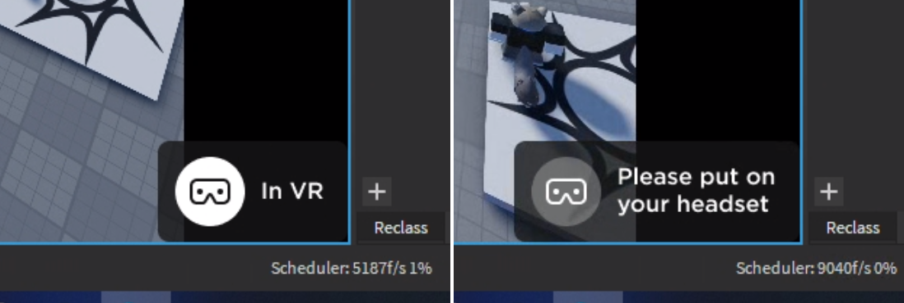

# roblox-vr-mods
A collection of various mods to modernise and improve Roblox VR

# Installation
Copy the contents of the mod/ folder into your Roblox Studio Mod Manager's mod folder.

# Licensing
The contents of this repo are licensed under Creative Commons BY-NC-SA 4.0: https://creativecommons.org/licenses/by-nc-sa/4.0/

# Mod list

## Better Spectate UI

Removes the account age indicator from the spectator UI, and aligns the VR idle UI with Roblox's design system.

